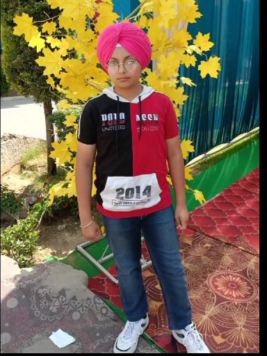

# Hacker-design-svg.github.io

## My Portfolio

My name is Gurman Singh.I study in VIII class in Partap Public School, Ludhiana. It is situated near Radha Swami Satsang Bhawan. I was born on 20 September 2010. I am very curios to learn about new technology. I want to become IAS officer by giving the UPSC competitive exam. This is one of the most difficult competitive exam. My hobby is to play cricket in free time and to listen songs. During solving maths problems I listen music to motivate myself. This is all about me.

